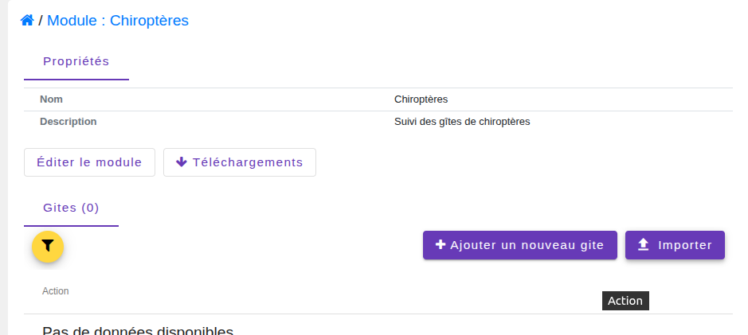
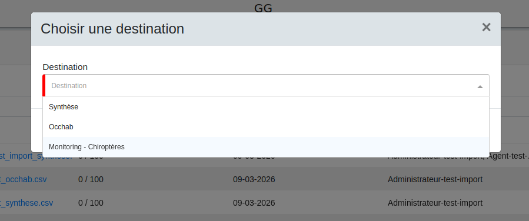

# Import de données protocolées en utilisant le module Import

Depuis la version 2.17.0 de GeoNature, un ensemble de fonctionnalités ont été ajoutées permettant d'importer des données de sites, visites et/ou observations depuis des fichiers CSV dans le module Monitoring, en s'appuyant sur le module Import de GeoNature.

>[!NOTE]    
>Ce développement a été réalisé dans le cadre d’un financement de PatriNat et du ministère de la Transition écologique, avec Natural Solutions et le Parc national des Écrins en charge des travaux d'intégration dans le module Monitoring.

## Pré-requis

- Disposer de la version 2.17.0 (ou plus) de GeoNature

## Compatibilité avec les protocoles

- L'import Monitoring permet uniquement importer des sites, des visites et des observations.
- Les instructions en JavaScript (JS) utilisées pour paramétrer un champ d'une entité (site, visite, observation) ne sont pas encore prises en compte. Ces instructions sont autorisées dans les propriétés `hidden` et `required`. À ce jour :

    - Si l'affichage d'un champ (propriété `hidden`) est conditionné par une instruction en JS, il est toujours affiché dans les champs de l'import. 
    - Si l'obligation d'un champ (propriété `required`) est conditionné par une instruction en JS, ce dernier est toujours requis dans les champs de l'import.

    Des développements sont en cours pour que ces conditions en JS deviennent utilisables dans le module Monitoring et dans le module Import.

## Comment importer les données ? 

Un import peut être lancé de deux façons : **depuis le module Import** directement, ou **depuis une
entité parente**, *i.e. importer des visites depuis un site, ou des observations depuis une visite* (Accessible depuis le bouton `Importer` dans le module Monitoring, cf. image ci-dessous). Dans ce cas, les données importées seront automatiquement associées à l'objet depuis lequel on importe.

Toutes les entités à importer doivent figurer dans un seul et même fichier CSV, selon le format
défini dans la documentation GeoNature. Vous pouvez trouver un exemple ici pour Occhab, ayant une logique similaire au niveau du lien entre les sites, leurs visites et leurs observations : [Exemple de fichier CSV](https://docs.geonature.fr/user-manual.html#exemple-de-fichier-csv-pour-l-import-occhab) 

> [!IMPORTANT]
> Pour pouvoir importer des données, il faut disposer des permissions sur l'action C dans le module Import et l'action C dans le sous-module Monitoring concernés.

## Mise en correspondance des observateurs

Depuis la version 2.17.0, l'import permet aussi de mettre en correspondance des observateurs par site et par visite.

### Observateurs des sites

Lors de la saisie d'un site, un champ unique permet de mettre en correspondance un observateur par site. En base de données ce champ est stocké dans la table `gn_monitoring.t_base_sites` dans la colonne `id_inventor`. Si vous ne mappez pas un observateur, la colonne `id_inventor` ne sera pas remplie.

### Observateurs des visites

Lors de la saisie d'une visite, deux champs paramétrables sont disponibles. L'un permet de sélectionner des utilisateurs dans une liste et l'autre permet d'indiquer les observateurs dans un champ texte. Dans le premier cas, la table de correspondance `gn_monitoring.cor_visit_observer` est remplie automatiquement, et dans le second cas, c'est la colonne `observer_txt` qui est remplie. Il est conseillé dans la documentation que seul un des deux champs soit utilisé.

Dans le cadre de l'import, seuls les observateurs renseignés dans les champs "Observateurs" de type liste (1er cas) seront utilisés pour la mise en correspondance avec les utilisateurs existants dans l'instance GeoNature.

## Activation de l'import dans un protocole de suivi Monitoring

Pour pouvoir importer des données d'un sous-module Monitoring, il faut d'abord que ledit sous-module soit configuré. Si ce n'est pas le cas, rendez-vous dans la section dédiée du sous-module, accessible depuis le bouton `Éditer le module`.

Une fois le sous-module configuré, il suffit de lancer la commande `geonature monitorings process_import <module_code>`.

Une fois la commande exécutée, le sous-module devient accessible dans la liste des destinations du module Import :

Les utilisateurs qui peuvent importer des données dans un sous-module Monitoring sont ceux qui ont des permissions de création sur ce sous-module ainsi que sur le module Import.

> [!IMPORTANT]
> A ce jour, les permissions d'importer ne prend pas en compte le détail des permissions définies au niveau de chaque entité (sites, visites et/ou observations). Si un l'utilisateur a la permission de créer une des trois entités (visite, sites ou observations) alors il est autorisé à créer un import de sites, visites et observations.

Pour en savoir plus sur le fonctionnement du module Import, voir sa documentation sur https://docs.geonature.fr/user-manual.html#import

## En cas de mise à jour du sous-module

En cas de mise à jour de la configuration d'un sous-module, il faut relancer la commande suivante pour répercuter dans la table `gn_imports.bib_fields`, les modifications de la définition des champs additionnels des sites, visites et observations : `geonature monitorings process_import <module_code>`.

